<!-- Light mode uses the source image. Dark is the fallback. -->
<picture>
  <source media="(prefers-color-scheme: light)" srcset="./assets/hero-light.svg">
  
</picture>

  

<picture>
  <source media="(prefers-color-scheme: light)" srcset="./assets/avatar-light.svg">
  
</picture>

  

<picture>
  <source media="(prefers-color-scheme: light)" srcset="./assets/visitor-clock-light.svg">
  
</picture>

### Nexor

Building reliable software with a calm, local-first setup.

 

<a href="https://pokyh.studio">
  <picture>
    <source media="(prefers-color-scheme: light)" srcset="./assets/badge-studio-light.svg">
    
  </picture>
</a>
&nbsp;
<a href="https://github.com/Plattnericus">
  <picture>
    <source media="(prefers-color-scheme: light)" srcset="./assets/badge-github-light.svg">
    
  </picture>
</a>

---

<!-- Rendered from data/profile-config.json. -->
<picture>
  <source media="(prefers-color-scheme: light)" srcset="./assets/system-map-light.svg">
  
</picture>

 

<picture>
  <source media="(prefers-color-scheme: light)" srcset="./assets/languages-light.svg">
  
</picture>

---

<!-- Rendered from data/profile-stats.json. The workflow keeps it fresh. -->
<picture>
  <source media="(prefers-color-scheme: light)" srcset="./assets/stats-panel-light.svg">
  
</picture>

<picture>
  <source media="(prefers-color-scheme: light)" srcset="./assets/footer-light.svg">
  
</picture>
