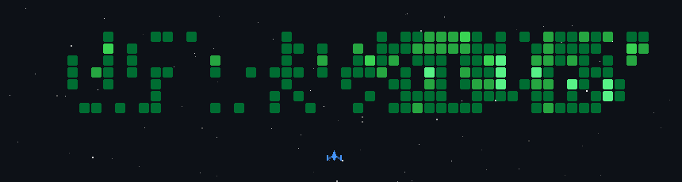

### `Nexor` · build. deploy. secure.

 

&nbsp;

&nbsp;

---

### `>` commit history, weaponised

every contribution is a target — the ship clears a year of commits, regenerated daily

---

### `~` projects

<table width="100%">
<tr>
<td width="50%" valign="top">
  <b>POKYH</b> 
  All-in-one school app for LBS Brixen — timetable, grades, mensa, reminders and WebUntis integration. 
  <code>Dart</code> <code>Next.js</code> <code>Docker</code>  
  
  
</td>
<td width="50%" valign="top">
  <b>ThreeJS Portfolio</b> 
  Interactive 3D portfolio visualising GitHub stars as a living WebGL world — camera choreography, real-time lighting. 
  <code>Three.js</code> <code>R3F</code> <code>TypeScript</code>  
  
  
  
</td>
</tr>
<tr>
<td width="50%" valign="top">
  <b>StreamDeck</b> 
  A browser desktop inspired by macOS — draggable windows, built-in tools, motion-driven UI. 
  <code>React</code> <code>JavaScript</code>  
  
  
  
</td>
<td width="50%" valign="top">
  <b>Minesweeper</b> 
  Real-time multiplayer Minesweeper with Socket.IO lobbies, Firebase auth, stats and leaderboards. 
  <code>Socket.IO</code> <code>Firebase</code> <code>JavaScript</code>  
  
</td>
</tr>
<tr>
<td width="50%" valign="top">
  <b>ProjectilePreview</b> 
  Client-side Fabric mod rendering the predicted trajectory of projectiles before you shoot. 
  <code>Java</code> <code>Fabric</code>  
  
  
</td>
<td width="50%" valign="top">
  <b>Magic-Mirror</b> 
  Wall-mounted smart display on a Raspberry Pi — time, weather and daily information as a calm always-on interface. 
  <code>Node.js</code> <code>Raspberry Pi</code>  
  
</td>
</tr>
</table>

  every project, written up in full → <a href="https://plattnericus.dev"><b>plattnericus.dev</b></a>

---

### `</>` stack

  

&nbsp;

