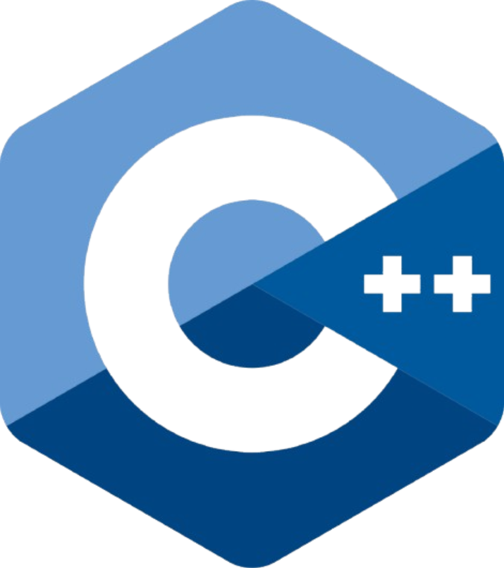
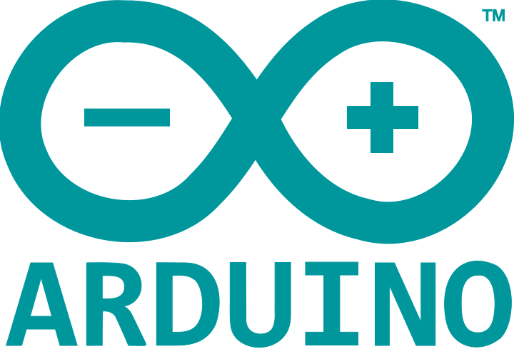

<h1>hello there! </h1>

**`turning ideas into reliable software.`**

*from low-level systems to high-level interfaces.*

 

`devops in the making` &nbsp;•&nbsp; `self-hosting enthusiast` &nbsp;•&nbsp; `south tyrol 🇮🇹`

 

&nbsp;

&nbsp;

---

### tech stack

<b>languages</b>

 

&nbsp;

&nbsp;

&nbsp;

&nbsp;

&nbsp;

  

<b>web & frameworks</b>

 

&nbsp;

&nbsp;

&nbsp;

&nbsp;

  

<b>databases</b>

 

&nbsp;

  

<b>systems & tools</b>

 

&nbsp;

&nbsp;

&nbsp;

  

---

### stats

&nbsp;

---

